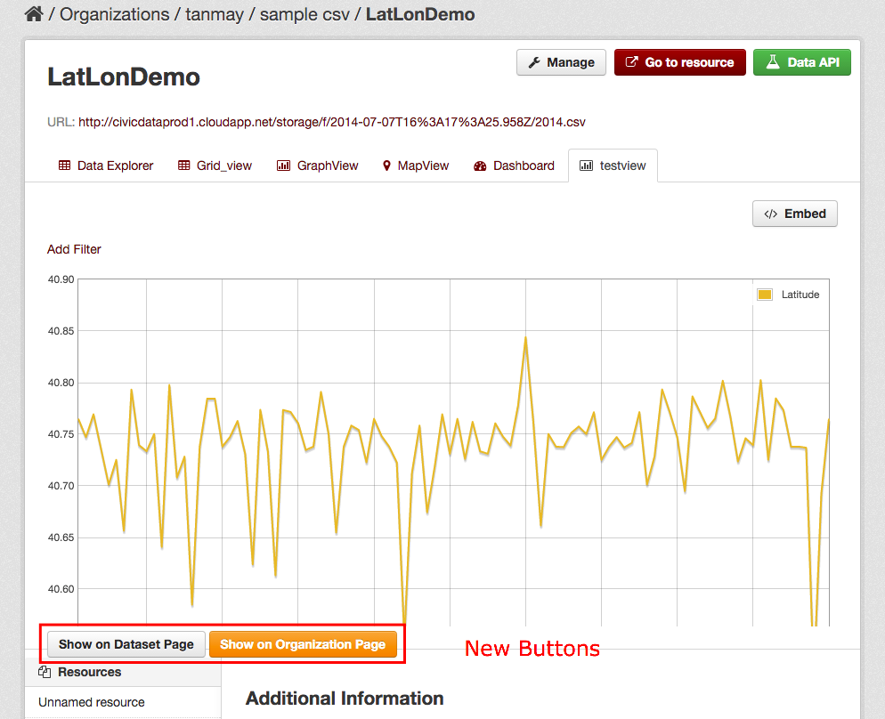

=============
ckanext-featuredviews
=============

Display select resource views on dataset and organization pages.

By default, CKAN only shows Resource Views on the resource page, but has no
mechanism for showing users which resources have visualizations, and where the
good ones are.

This extension lets you mark Resource Views as featured so they show up right
on your organization page (instead of resource or home page).

This extension is tested with:
 1. CKAN 2.4
 2. Organization with no dataset/ resource
 3. Organization with all private featured views
 4. Organization with both private and public featured views.

Few use cases:
  1. Featured views from private resource should not show any error page.
  2. Featured views from private resource should be hidden from unauthorized users.
  3. Unauthorized users should not see 'Show on Dataset' or 'Show on Organization page' button.
  4. Location of the buttons should be immediately after the preview.

Usage
=============
Clone it. This package is not on PyPI yet: ::

    git clone https://github.com/tanmayAccela/ckanext-featuredviews.git
    cd ckanext-featuredviews
    python setup.py develop
    

Add to the list of plugins: ::

    ckan.plugins = ... featuredviews

The database table for civicdata_featured views should be created automatically at startup.
So the following command is optional: ::

    paster --plugin=ckanext-featuredviews featured migrate -c production.ini

Demo
=============
.. topic:: Example screenshot

Once enabled, the extension displays two buttons as shown in the screenshot:

The buttons are used to bring the views as featured views on 'dataset' or 'organization' page.